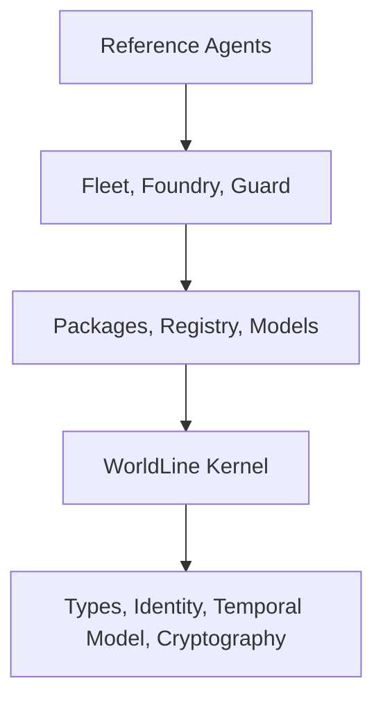

# MAPLE by MapleAI - The Agent Operating System

> Ship agents like software. Govern them like infrastructure.

MAPLE is the open-source runtime and supply-chain foundation for the MapleAI Agent OS. It combines governed execution, worldline identity, provenance, package artifacts, model control, and operational surfaces for agent systems that can create real consequences.

Brand: `MapleAI`  
Legal entity: `MapelAI Intelligence Inc.`

## What Ships In This Repository Today

- Runtime and consequence control: `maple-cli`, `palm-daemon`, `maple-runtime`, `worldline-*`, and `maple-kernel-*`
- Package and registry foundations: `maple-package`, `maple-init`, `maple-build`, `maple-package-trust`, and `maple-registry-client`
- Model-control foundations: `maple-model-core`, `maple-model-router`, `maple-model-server`, `maple-model-benchmark`, backend adapters, and PALM playground integration
- Governance and improvement: `maple-guard-*`, `maple-foundry-*`, `maple-fleet-*`, and `palm-*`

## What "Docker-like" Means In MAPLE

MAPLE's Docker-like layer is the agent package supply chain. The core idea is that an agent is a versioned artifact with an explicit contract, not a folder of prompts plus ad hoc glue.

Implemented foundations:

- `maple-package` parses and validates `Maplefile.yaml`
- `maple-init` generates templates and scaffold directories for package kinds
- `maple-build` resolves dependencies, assembles deterministic OCI layers, and writes `maple.lock`
- `maple-package-trust` signs digests, generates SBOMs, and creates build attestations
- `maple-registry-client` pushes, pulls, and mirrors OCI artifacts
- `maple-fleet-stack` defines stack YAML and dependency ordering for multi-service agent systems

Current instruction:

1. Author a `Maplefile.yaml` using the implemented schema in [docs/guides/maplefile.md](docs/guides/maplefile.md).
2. Scaffold package directories manually or via the `maple-init` crate.
3. Use the build, trust, and registry crates from Rust or internal automation.
4. Use PALM plus fleet crates for deployment control.

Important: the final top-level `maple build`, `maple sign`, `maple push`, and `maple up` UX is not exposed in `maple-cli` yet. The crates are present; the public product CLI is still converging.

## What "Ollama-like" Means In MAPLE

MAPLE's Ollama-like layer is model control, not just local model download. The repo already implements model metadata, a local model store, routing policy, backend neutrality, and OpenAI-compatible serving types.

Implemented foundations:

- `maple-model-core` stores models under `~/.maple/models` and parses `MapleModelfile`
- `maple-model-router` routes across backends with policy, fallback, and circuit breaking
- `maple-model-server` provides OpenAI-compatible request and response types plus handler logic
- `maple-model-benchmark` defines benchmark suites and quality gates
- PALM playground can target `local_llama`, `open_ai`, `anthropic`, `grok`, and `gemini`

Current instruction:

1. Start Ollama locally:

```bash
ollama serve
ollama pull llama3.2:3b
```

2. Verify the runtime path:

```bash
cargo run -p maple-cli -- doctor --model llama3.2:3b
```

3. Start PALM:

```bash
cargo run -p maple-cli -- daemon start --foreground
```

4. Point PALM playground at Ollama:

```bash
cargo run -p palm -- playground set-backend \
  --kind local_llama \
  --model llama3.2:3b \
  --endpoint http://127.0.0.1:11434

cargo run -p palm -- playground infer "Summarize current runtime status"
```

Important: the final `maple model pull`, `maple model run`, and `maple model serve` CLI is not exposed in `maple-cli` yet. Today the practical operator path is Ollama plus PALM playground plus the model crates.

## What You Can Run Today

```bash
# Inspect the current CLI surface
cargo run -q -p maple-cli -- --help

# Check PALM, Postgres, and Ollama connectivity
cargo run -p maple-cli -- doctor --model llama3.2:3b

# Run the local agent demo
cargo run -p maple-cli -- agent demo --prompt "log current runtime status"

# Start the daemon
cargo run -p maple-cli -- daemon start --foreground

# In another terminal: inspect the runtime
cargo run -p maple-cli -- kernel status
cargo run -p maple-cli -- worldline create --profile agent --label demo-agent
cargo run -p maple-cli -- worldline list

# Use PALM directly or via `maple palm ...`
cargo run -p palm -- playground backends
cargo run -p palm -- deployment list
```

## Architecture At A Glance



- Reference agents: support, finance, compliance, and operator workflows
- Fleet / Foundry / Guard: rollout, eval, approvals, policy, and compliance
- Packages / Registry / Models: artifact supply chain plus model routing and serving foundations
- WorldLine kernel: commitment boundary, memory, provenance, and event fabric
- Foundation: types, identity, temporal, and cryptographic primitives

## Quick Start Paths

### Path A: Install and run the current runtime

- [Installation](docs/getting-started/installation.md)
- [5-Minute Quickstart](docs/getting-started/quickstart.md)
- [CLI Reference](docs/api/cli-reference.md)

### Path B: Author the first package contract

- [Author Your First Agent Package](docs/getting-started/first-agent.md)
- [Maplefile Reference](docs/guides/maplefile.md)
- [Guard and Policies](docs/guides/guard-policies.md)

### Path C: Go deeper on packaging, models, and architecture

- [Architecture Overview](docs/architecture/overview.md)
- [Model Management](docs/guides/model-management.md)
- [Fleet Deployment](docs/guides/fleet-deployment.md)
- [REST API](docs/api/rest-api.md)

## Documentation Map

- [Docs Index](docs/README.md)
- [Architecture](docs/architecture/overview.md)
- [Getting Started](docs/getting-started/installation.md)
- [Guides](docs/guides/maplefile.md)
- [API](docs/api/README.md)
- [Reference](docs/reference/invariants.md)
- [Comparison](docs/comparison.md)
- [Tutorials](docs/tutorials/worldline-quickstart.md)

## Repository Layout

```text
maple/
├── crates/               # Runtime, package, model, guard, fleet, and worldline crates
├── contracts/            # Packaging and conformance contracts
├── examples/             # Runnable worldline and runtime examples
├── docs/                 # Canonical documentation set
├── ibank/                # Domain-specific financial application surfaces
└── deploy/               # Deployment assets when present
```

## Status

MAPLE is in the middle of the MapleAI Agent OS redesign.

- The runtime, worldline, daemon, and PALM operational surfaces are the most complete public interfaces today.
- The package, registry, model, guard, foundry, and fleet layers are implemented primarily as crates.
- The docs in this repo now distinguish between "implemented now" and "target product UX" where that boundary matters.

## Contributing

- [Contributing Guide](CONTRIBUTING.md)
- [Roadmap](ROADMAP.md)
- [Changelog](CHANGELOG.md)

## Contact

- Website: <https://www.mapleai.org>
- Docs: <https://www.mapleai.org/docs>
- Email: <hello@mapleai.org>

## License

Copyright 2026 - MapelAI Intelligence Inc.
