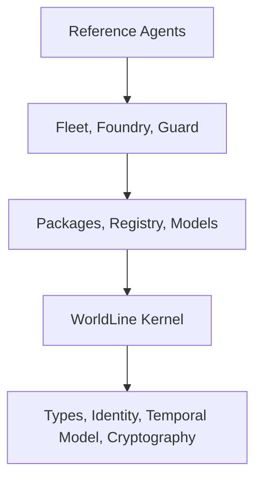

# MAPLE by MapleAI - The Agent Operating System

> Ship agents like software. Govern them like infrastructure.

MAPLE is the open-source kernel and control-plane foundation for the MapleAI Agent OS. It packages the runtime, governance, provenance, model routing, and operational surfaces needed to move agentic systems from experiments into production.

This repository currently exposes the core layers that power that design:

- WorldLine-first runtime and provenance primitives
- PALM daemon and operational control plane
- `maple` CLI for local development, daemon operations, and governed worldline flows
- package, model, guard, foundry, and fleet crates that define the Agent OS supply chain

Brand: `MapleAI`  
Legal entity: `MapelAI Intelligence Inc.`

## What MAPLE Does

- Package agents as versioned artifacts with Maplefile manifests, build provenance, signing, and SBOM support
- Route local and hosted models behind one policy-aware control surface
- Enforce deny-by-default capability access through Guard and commitment gating
- Record worldline receipts so decisions and outcomes stay replayable and auditable
- Scale governed agents through fleet, rollout, budget, and tenancy controls
- Improve production behavior through trace capture, eval loops, and distillation workflows

## What You Can Run Today

```bash
# Start the daemon
cargo run -p palm-daemon

# Create a worldline
cargo run -p maple-cli -- worldline create --profile financial --label treasury-a

# Inspect kernel state
cargo run -p maple-cli -- kernel status
```

Those commands exercise the current implementation surfaces directly. The broader Agent OS redesign described in the docs is built on top of these runtime, provenance, and control-plane layers.

## Architecture at a Glance



- Reference agents: support, finance, compliance, operator workflows
- Fleet / Foundry / Guard: rollout, eval, approvals, policy, compliance
- Packages / Registry / Models: artifact supply chain and model operations
- WorldLine kernel: commitment boundary, memory, provenance, event fabric
- Foundation: types, identity, temporal and crypto primitives

## Quick Start Paths

### Path A: Installation and first run

- [Installation](docs/getting-started/installation.md)
- [5-Minute Quickstart](docs/getting-started/quickstart.md)

### Path B: Build your first governed agent

- [First Agent Tutorial](docs/getting-started/first-agent.md)
- [Maplefile Reference](docs/guides/maplefile.md)
- [Guard and Policies](docs/guides/guard-policies.md)

### Path C: Deep architecture and APIs

- [Architecture Overview](docs/architecture/overview.md)
- [REST API](docs/api/rest-api.md)
- [CLI Reference](docs/api/cli-reference.md)

## Documentation Map

- [Docs Index](docs/README.md)
- [Architecture](docs/architecture/overview.md)
- [Getting Started](docs/getting-started/installation.md)
- [Guides](docs/guides/maplefile.md)
- [API](docs/api/README.md)
- [Reference](docs/reference/invariants.md)
- [Comparison](docs/comparison.md)
- [Tutorials](docs/tutorials/worldline-quickstart.md)

## Repository Layout

```text
maple/
├── crates/               # Runtime, package, model, guard, fleet, and worldline crates
├── contracts/            # Packaging and conformance contracts
├── examples/             # Runnable demos and end-to-end reference flows
├── docs/                 # Canonical documentation set
├── ibank/                # Domain-specific financial application surfaces
└── deploy/               # Deployment assets when present
```

## Status

MAPLE is in the middle of an Agent OS redesign. The repository already contains the foundational implementation for:

- worldline identity and provenance
- PALM daemon operations
- packaging, registry, and model-management crates
- guard, foundry, and fleet crate families

Some top-level docs describe the full target operating model even where the UX is still converging on the final `maple build`, `maple run`, and `maple model` ergonomics.

## Contributing

- [Contributing Guide](CONTRIBUTING.md)
- [Roadmap](ROADMAP.md)
- [Changelog](CHANGELOG.md)

## Contact

- Website: <https://mapleai.org>
- Docs: <https://mapleai.org/docs>
- Email: <hello@mapleai.org>

## License

MIT OR Apache-2.0
