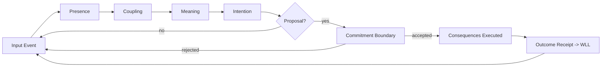

# 01 - WorldLine Model

A WorldLine is the canonical runtime unit of persistence and evolution in MAPLE.
Agents, services, bots, and institutions are all WorldLines with different profiles,
capabilities, and governance constraints.

> WorldLine-first: "Agent" is an application concept; WorldLine is the kernel concept.

## 1.1 The WorldLine tuple

A WorldLine at time `t` is modeled as:

```text
WL(t) = { ID, Sigma(t), M(t), Theta(t), Pi, Lambda }

Where:
- ID: identity + continuity keys
- Sigma(t): state (observable + latent)
- M(t): memory planes (working/episodic/semantic)
- Theta(t): temporal anchors + event cursor
- Pi: operator (evolution law) + pipeline configuration
- Lambda: ledger bindings (WLL stream id, receipt cursor, snapshot policy)
```

This maps directly to implementation split:
- `worldline-core`: types/traits for ID/Sigma/M/Theta/Pi/Lambda
- `worldline-runtime`: scheduling + pipeline + gating
- `worldline-ledger`: append-only receipts + replay + proofs

## 1.2 Identity and continuity

WorldLines are not just UUIDs. Continuity is enforceable and verifiable.

```rust
/// worldline-core
pub struct WorldLineId(pub [u8; 32]);

pub struct Continuity {
    pub genesis_hash: [u8; 32],     // immutable origin
    pub head_receipt: [u8; 32],     // latest committed receipt hash
    pub epoch: u64,                 // rotation boundary (optional)
}

pub struct WorldLineIdentity {
    pub id: WorldLineId,
    pub continuity: Continuity,
    pub signing_key_ref: String,    // HSM/KMS ref or local key id
}
```

Continuity rules:
- Genesis is immutable.
- Head receipt must match the ledger cursor.
- Any fork must be explicitly modeled as a new worldline (or a sanctioned branch).

## 1.3 State model

WorldLine state is split to keep cognition fast and commitments auditable:

```rust
pub struct WorldLineState {
    pub observable: ObservableState, // UI-facing / reported
    pub latent: LatentState,         // internal embeddings, beliefs, summaries
}

pub struct StateDelta {
    pub patch: Vec<u8>,              // canonical patch format
    pub hash: [u8; 32],              // integrity
}
```

Rule:
- Only committed deltas become canonical.
- Non-committed deltas are ephemeral (they can guide intention, not reality).

## 1.4 Memory planes (minimal kernel view)

Memory is a set of planes with distinct mutability rules:
- Working: ephemeral context window (not ledgered)
- Episodic: event-linked summaries (ledger-referenced)
- Semantic: consolidated facts/skills (ledger-anchored via provenance)
- Parametric: model weights / operator code (high-tier commitments only)

Kernel requirement:
- When memory changes affect behavior, the change must be attributable to a
  commitment class (directly or via projection).

## 1.5 Operator (evolution law)

Operators define how a worldline thinks and acts, but they do not bypass gating.

```rust
pub trait WorldLineOperator: Send + Sync {
    fn presence(&self, input: &InputEvent, ctx: &mut Ctx) -> Presence;
    fn coupling(&self, p: Presence, ctx: &mut Ctx) -> Coupling;
    fn meaning(&self, c: Coupling, ctx: &mut Ctx) -> Meaning;
    fn intention(&self, m: Meaning, ctx: &mut Ctx) -> Intention;

    /// Produces a commitment proposal (no effects).
    fn propose(&self, i: Intention, ctx: &mut Ctx) -> Option<CommitmentProposal>;
}
```

Operators can be hot-swapped, but swaps are:
- gated by commitment class (often high tier),
- recorded in WLL,
- replayable (operator version is part of provenance).

## 1.6 Lifecycle

A worldline runs in a loop (or event-driven schedule):



Important:
- The commitment boundary is outside operator control.
- Rejections are first-class outcomes (also ledgerable when policy requires).

## 1.7 WorldLine classes (examples)

- User-facing agent: strict capability set; low-tier commitments.
- Indexer worldline: heavy IO; commitments may be batched.
- Operator bot: can propose upgrades; requires multi-approval policy.
- Institution worldline: governance-heavy; strong audit requirements.

## 1.8 WorldLine invariants (kernel-enforced)

WL1 - Continuity must validate
- On startup, worldline identity must validate against ledger head receipt.

WL2 - Ordered cognition
- Pipeline stages occur in order unless policy explicitly marks a skip.

WL3 - Commitments are the only path to canonical state
- Canonical state transitions must have receipts.

WL4 - Operator version is provenance
- Any decision/execution must reference the operator hash/version used.

WL5 - Replay must converge
- Given identical inputs and ledger receipts, replay yields the same canonical state.

## 1.9 Next

- [03 - Commitment Boundary](03-commitment-boundary.md)
- [04 - WorldLine Ledger (WLL)](04-ledger-wll.md)
