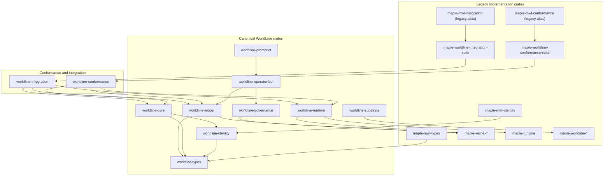
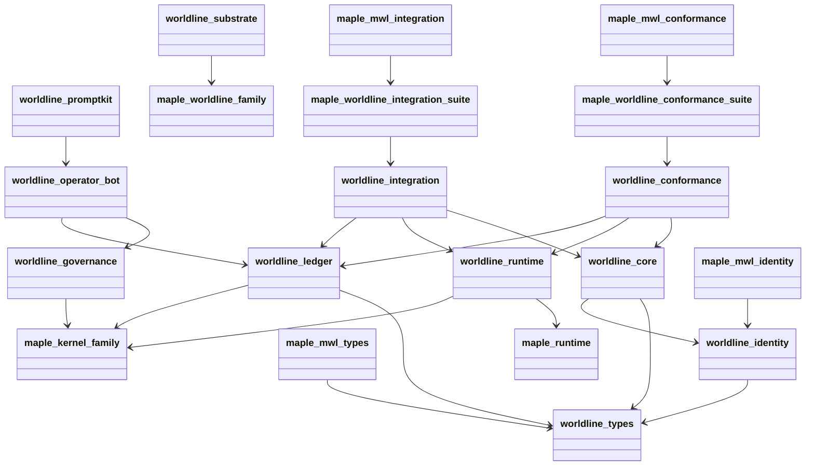

# 02 - Crate and Component Layout

This document defines the canonical crate layout for WorldLine, plus the
compatibility layer that preserves existing `maple-*` and `palm-*` consumers.

## 2.1 Canonical layout (filesystem)

```text
crates/
  worldline/
    types/        (crate: worldline-types)
    identity/     (crate: worldline-identity)
    core/         (crate: worldline-core)
    runtime/      (crate: worldline-runtime)
    ledger/       (crate: worldline-ledger)
    governance/   (crate: worldline-governance)
    operator-bot/ (crate: worldline-operator-bot)
    promptkit/    (crate: worldline-promptkit)
    substrate/    (crate: worldline-substrate)
    conformance/  (crate: worldline-conformance)
    integration/  (crate: worldline-integration)

  # compatibility and legacy implementation crates
  maple-worldline-conformance-suite
  maple-worldline-integration-suite
  maple-mwl-*
  maple-kernel-*
  maple-worldline-*
  maple-runtime
  palm/*
```

## 2.2 Component dependency graph (text)

```text
maple-mwl-types     -> worldline-types
maple-mwl-identity  -> worldline-identity
worldline-types     -> (native implementation)
worldline-identity  -> worldline-types
worldline-core      -> worldline-types + worldline-identity

worldline-runtime   -> maple-runtime
                    -> maple-kernel-{fabric,memory,gate,mrp,provenance,
                                     governance,safety,profiles,financial}

worldline-ledger    -> worldline-types (canonical traits + projections + replay)
                    -> maple-kernel-provenance + maple-kernel-fabric (compat exports)

worldline-governance -> maple-kernel-governance
                      -> maple-kernel-gate
                      -> maple-kernel-safety
                      -> maple-kernel-profiles

worldline-operator-bot -> worldline-governance + worldline-ledger + worldline-types
worldline-promptkit    -> prompt contracts and tool schemas for worldline-operator-bot

worldline-substrate -> maple-worldline-{observation,meaning,intent,commitment,
                                        consequence,self-mod-gate,codegen,
                                        deployment,ir,langgen,compiler,sal,
                                        hardware,bootstrap,evos,conformance}

maple-worldline-{conformance-suite,integration-suite} -> worldline-{conformance,integration}
maple-mwl-{conformance,integration} -> legacy aliases for maple-worldline-{conformance-suite,integration-suite}
worldline-{conformance,integration} -> worldline-{core,runtime,ledger}
maple-worldline-*                   -> worldline-{core,runtime} (selected crates)
```

## 2.3 Component dependency graph (visual)

### Flowchart



### UML-style component view



## 2.4 Naming policy

- Use `worldline-*` crates for all new integration code and docs.
- Keep `maple-*` and `palm-*` crates as compatibility surfaces during migration.
- Treat compatibility crates as stable aliases, not as the long-term primary API.

## 2.5 Why this layout

- Reduces cognitive overhead: one canonical namespace for architecture-level concepts.
- Preserves backward compatibility for existing deployments.
- Keeps control-plane and data-plane boundaries explicit while enabling gradual migration.

## 2.6 Compatibility relationships

- `worldline-types` and `worldline-identity` now hold the canonical implementations.
- `maple-mwl-types` and `maple-mwl-identity` are compatibility wrappers.
- `worldline-core` composes `worldline-types` and `worldline-identity`.
- `worldline-operator-bot` and `worldline-promptkit` provide canonical
  governance automation contracts.
- `worldline-conformance` and `worldline-integration` are canonical suite crates.
- `maple-worldline-conformance-suite` and `maple-worldline-integration-suite`
  are Maple-level suite wrappers.
- `maple-mwl-conformance` and `maple-mwl-integration` remain legacy aliases.
- Legacy `maple-kernel-*` and `maple-worldline-*` crates remain the implementation
  substrate for one compatibility cycle.
