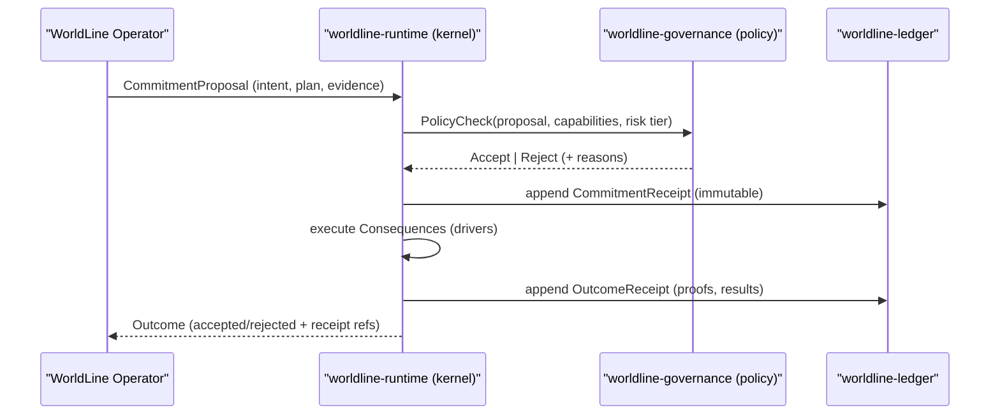

# 03 - Commitment Boundary

The Commitment Boundary is the kernel-owned, non-bypassable gate between cognition
(intent) and consequences (effects). It enforces policy, capability, and invariants,
then produces immutable receipts.

> If a change matters, it crosses the boundary.

## 3.1 Why it exists

Without a strict boundary, agent autonomy becomes:
- un-auditable side effects,
- policy drift,
- irreproducible behavior,
- unsafe self-modification,
- impossible rollback.

The commitment boundary solves this by making irreversible acts explicit.

## 3.2 Commitment flow (canonical)



Key point:
- Governance can be a human, a bot, or a rule engine.
- The kernel is the final enforcement authority.

## 3.3 Data structures

```rust
/// worldline-core
pub enum CommitmentClass {
    ReadOnly,            // no irreversible actions
    ExternalIO,          // network, file writes, API calls
    FundsMovement,       // financial actions (high tier)
    PolicyChange,        // governance updates
    OperatorUpgrade,     // operator swap or parametric update (highest tier)
}

pub struct EvidenceBundle {
    pub references: Vec<String>,  // object store pointers, hashes, urls
    pub digest: [u8; 32],         // integrity
}

pub struct CommitmentProposal {
    pub worldline: WorldLineId,
    pub class: CommitmentClass,
    pub intent: String,           // human-readable why
    pub plan: Vec<u8>,            // structured plan (machine)
    pub requested_caps: Vec<String>,
    pub evidence: EvidenceBundle,
    pub nonce: u64,
}

pub struct CommitmentReceipt {
    pub worldline: WorldLineId,
    pub proposal_hash: [u8; 32],
    pub decision: Decision,       // accepted/rejected
    pub policy_hash: [u8; 32],    // policy used in evaluation
    pub caps_granted: Vec<String>,
    pub timestamp_ms: u64,
    pub receipt_hash: [u8; 32],   // hash chain anchor
}

pub struct OutcomeReceipt {
    pub worldline: WorldLineId,
    pub commitment_receipt_hash: [u8; 32],
    pub outcome_hash: [u8; 32],
    pub effects: Vec<EffectSummary>,
    pub proofs: Vec<ProofRef>,
    pub timestamp_ms: u64,
}
```

Notes:
- `intent` is for audit; `plan` is for deterministic execution.
- Evidence is referenced, not embedded (ledger remains small and secrets stay out).
- Receipts are hash-chained.

## 3.4 Non-bypassability (enforcement)

Rule: no driver capable of irreversible effects is callable without a receipt.

Implementation pattern:

```rust
/// worldline-runtime
pub trait ConsequenceDriver {
    fn execute(&self, receipt: &CommitmentReceipt, plan: &[u8]) -> anyhow::Result<DriverResult>;
}

pub struct CommitmentGate {
    policy: Arc<dyn PolicyEngine>,
    ledger: Arc<dyn LedgerWriter>,
    drivers: DriverRegistry,
}

impl CommitmentGate {
    pub fn run(&self, proposal: CommitmentProposal) -> anyhow::Result<OutcomeReceipt> {
        // 1) validate invariants (kernel-owned)
        self.validate(&proposal)?;

        // 2) policy/capability decision
        let decision = self.policy.evaluate(&proposal)?;

        // 3) append commitment receipt
        let creceipt = self.ledger.append_commitment(&proposal, &decision)?;

        // 4) execute consequences only if accepted
        if decision.accepted {
            let result = self.drivers.execute(&creceipt, &proposal.plan)?;
            let oreceipt = self.ledger.append_outcome(&creceipt, &result)?;
            Ok(oreceipt)
        } else {
            let oreceipt = self.ledger.append_rejection_outcome(&creceipt)?;
            Ok(oreceipt)
        }
    }
}
```

The operator never calls drivers directly; it only proposes.

## 3.5 Policy tiers (EVOS-friendly)

A practical tiering model:
- Tier 0: Read-only (no receipt required, optional logging)
- Tier 1: External IO (receipt required, single-policy check)
- Tier 2: Funds movement / legal risk (receipt + multi-approval)
- Tier 3: Operator upgrades / self-mod (receipt + quorum + staged rollout)

Policy engine can be:
- static rules,
- bot recommendations,
- multi-sig approval (human + bot quorum),
- formal verification gates.

Enforcement remains kernel-side.

## 3.6 Boundary invariants

CB1 - Proposal is intent, not effect
- Proposals must be safe to generate and store.

CB2 - Receipts are immutable
- Receipts never change; corrections are new receipts.

CB3 - No driver without receipt
- Driver entry points must require a receipt reference.

CB4 - Proofs are referenced
- Proof artifacts are stored externally and referenced by hash.

CB5 - Rejection is first-class
- Rejections must be explainable and optionally ledgered.

## 3.7 Next

- [04 - WorldLine Ledger (WLL)](04-ledger-wll.md)
