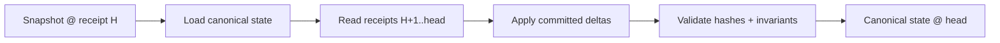

# 04 - WorldLine Ledger (WLL)

The WorldLine Ledger (WLL) is the append-only, replayable record of evolution.
It stores commitments, outcomes, and provenance so worldlines can be audited,
reconstructed, and proven.

> The ledger is not logs. It is the evolution substrate.

## 4.1 What the ledger records

For each worldline stream:
- Commitment Receipts: what was proposed, which policy evaluated it, decision, grants.
- Outcome Receipts: what effects were executed and what proofs exist.
- Cursors: monotonic sequencing to ensure replay order.
- Snapshot links: periodic state snapshots anchored to receipt hashes.

The ledger answers:
- WHY did this happen? (intent + evidence + policy)
- WHAT happened? (effects)
- WHO did it? (worldline identity + capabilities)
- WHEN did it happen? (monotonic time + timestamps)
- HOW can we prove it? (hash chain + proofs)

## 4.2 Ledger model (streams + receipts)

```text
WLL
 +- Stream: WorldLineId
 |   +- Receipt #1  (commitment)
 |   +- Receipt #2  (outcome)
 |   +- Receipt #3  (commitment)
 |   +- Receipt #4  (outcome)
 |   +- ...
 +- Projections (derived views)
     +- latest_state
     +- audit_index
     +- capability_graph
     +- provenance_dag
```

Receipts are hash-linked to form an integrity chain:

```text
r0 -> r1 -> r2 -> r3 -> ...
```

Each receipt includes `prev_receipt_hash` (or equivalent anchor).

## 4.3 Minimal schema (conceptual)

Treat this as a logical model even if implementation changes:

```sql
CREATE TABLE wll_receipts (
  worldline_id       BYTEA NOT NULL,
  seq               BIGINT NOT NULL,
  receipt_hash      BYTEA NOT NULL,
  prev_hash         BYTEA,
  kind              TEXT  NOT NULL,
  payload           BYTEA NOT NULL,
  timestamp_ms      BIGINT NOT NULL,
  PRIMARY KEY (worldline_id, seq)
);

CREATE INDEX wll_receipts_hash_idx ON wll_receipts (receipt_hash);
CREATE INDEX wll_receipts_kind_idx ON wll_receipts (worldline_id, kind, seq);

CREATE TABLE wll_snapshots (
  worldline_id         BYTEA NOT NULL,
  snapshot_seq         BIGINT NOT NULL,
  anchored_receipt     BYTEA NOT NULL,
  state_blob           BYTEA NOT NULL,
  state_hash           BYTEA NOT NULL,
  timestamp_ms         BIGINT NOT NULL,
  PRIMARY KEY (worldline_id, snapshot_seq)
);
```

## 4.4 Ledger interfaces (runtime contracts)

```rust
/// worldline-ledger
pub trait LedgerWriter {
    fn append_commitment(
        &self,
        proposal: &CommitmentProposal,
        decision: &Decision,
        policy_hash: [u8; 32]
    ) -> Result<CommitmentReceipt, LedgerError>;

    fn append_outcome(
        &self,
        commitment_receipt_hash: [u8; 32],
        outcome: &OutcomeRecord
    ) -> Result<OutcomeReceipt, LedgerError>;

    fn append_rejection_outcome(
        &self,
        commitment_receipt_hash: [u8; 32],
        reason: &str
    ) -> Result<OutcomeReceipt, LedgerError>;

    fn append_snapshot(
        &self,
        snapshot: &SnapshotInput
    ) -> Result<SnapshotReceipt, LedgerError>;
}

pub trait LedgerReader {
    fn head(&self, worldline: &WorldlineId) -> Result<Option<ReceiptRef>, LedgerError>;
    fn read_range(&self, worldline: &WorldlineId, from: u64, to: u64) -> Result<Vec<Receipt>, LedgerError>;
    fn read_all(&self, worldline: &WorldlineId) -> Result<Vec<Receipt>, LedgerError>;
    fn get_by_hash(&self, hash: [u8; 32]) -> Result<Option<Receipt>, LedgerError>;
    fn worldlines(&self) -> Result<Vec<WorldlineId>, LedgerError>;
}
```

Current canonical implementation:
- `InMemoryLedger` in `worldline-ledger::memory` implements both traits.
- Legacy compatibility index remains at `worldline-ledger::provenance`.

## 4.5 Replay semantics

Replay reconstructs canonical state:



Rules:
- Only accepted commitments with valid outcomes modify canonical state.
- Rejected commitments may exist for audit but do not change state.
- Operator version references must be preserved for consistent plan interpretation.

## 4.6 Projections (derived views)

Projections make the ledger usable without violating append-only:
- `latest_state` (`ProjectionBuilder::latest_state`)
- `audit_index` (`ProjectionBuilder::audit_index`)
- `provenance_dag` (`worldline-ledger::provenance` compatibility index)

Projection updates are deterministic, idempotent, and rebuildable from receipts.

Replay helpers:
- `ReplayEngine::replay_from_genesis`
- `ReplayEngine::replay_from_snapshot`
- `ReplayEngine::verify_snapshot_convergence`

## 4.7 Proofs and evidence

Store proofs externally:
- object store or content-addressed storage
- reference by hash in receipts (`ProofRef`, `EvidenceBundle`)

Ledger remains lean but cryptographically anchored.

## 4.8 Ledger invariants

L1 - Append-only
- No updates, no deletes. Corrections are new receipts.

L2 - Hash integrity
- Each receipt hash must validate payload and previous link.

L3 - Monotonic sequence
- Per-worldline `seq` is strictly increasing.

L4 - Outcome attribution
- Every outcome references a commitment receipt hash.

L5 - Snapshot anchoring
- Snapshots anchor to a receipt hash and validate `state_hash`.

## 4.9 Next

- Memory planes and provenance (future doc)
- Governance + operator bots (future doc)
